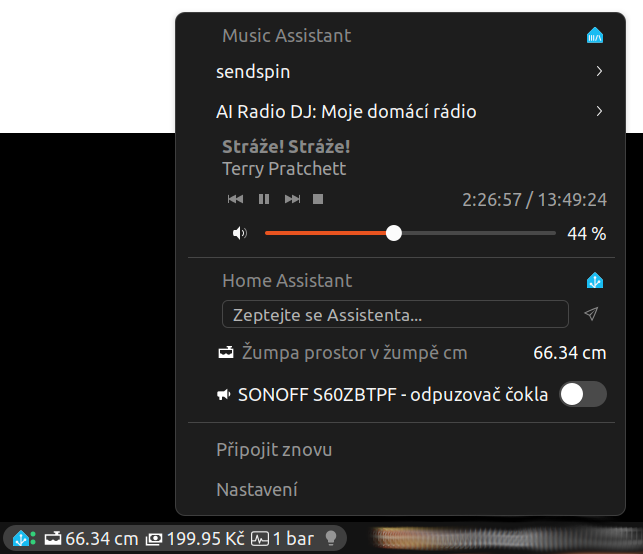

# gnome-hmass

GNOME Shell extension (GNOME 42–48) integrating **Home Assistant** and
**Music Assistant** into the top bar.

Repository: <https://github.com/konikvranik/gnome-hmass>

License: **GPL-2.0-or-later** (see [LICENSE](LICENSE)). The project follows
the [GNOME Code of Conduct](https://conduct.gnome.org/) — please be kind and
considerate in issues and discussions.

*Read this in: **English** | [Čeština](README.cs.md)*



## Features

### Home Assistant
- **Values in the top bar** – any entities (typically sensors) are shown as
  compact text right in the GNOME panel (e.g. `21.4 °C`). For numeric values
  you can set the number of decimal places (automatic per entity, or fixed
  0–4).
- **Entity icons from Home Assistant** – switches, buttons and other entities
  show their HA icon (`mdi:…` from the entity attributes). The extension
  bundles the complete MDI icon set (~7.4k icons, Apache-2.0, same source as
  HA), so it works offline and no icon is ever missing; when an entity has no
  icon, a domain-based icon is used instead. The icon source can be switched
  globally as well as per entity. A light's state is visible by color: a
  turned-on light shows its current light color (`rgb_color`/`hs_color`/color
  temperature), a turned-off one is clearly dimmed.
- **Per-entity settings** – the button next to an entity in the settings opens
  a dialog with overrides for that entity only: custom name, icon source,
  panel display mode (icon only / icon + value / value only), number of
  decimal places and thresholds — a value outside the range is highlighted in
  red. Settings apply to both the top bar and the menu.
- **Control right in the top bar** – switches (`switch`, `light`, `fan`, …)
  and buttons (`script`, `scene`, `button`, …) are operated by clicking in the
  panel, `input_number` with the mouse wheel, `input_select` cycles options on
  click and `input_text` is a text entry. The entity name (and a control hint)
  appears on hover.
- **Popup menu on click** – the control type is **chosen automatically by
  entity domain**:
  | Domain | Control |
  |---|---|
  | `switch`, `light`, `fan`, `input_boolean`, `automation`, `cover`, `humidifier` | toggle |
  | `script`, `scene`, `button`, `input_button` | run button |
  | `input_number`, `number` | slider with min/max/step from HA |
  | `light` with brightness | brightness slider in addition |
  | `media_player` | volume slider in addition |
  | `cover` with position | position slider in addition |
  | `input_select`, `select` | dropdown with options |
  | `input_text` | text entry |
  | `sensor`, `binary_sensor`, `weather` and others | value display |
- **Assist chat in the menu** – text conversation with the Home Assistant
  assistant. It uses the agent and language of the preferred **Assist
  pipeline** (same as the voice assistant and the HA apps), so it understands
  the same phrases and can run scenes and scripts.
- **Global hotkey** (default `Ctrl+Super+H`, configurable in the settings)
  opens the menu and puts the cursor right into the Assist chat entry.
- Values update in real time over WebSocket (`state_changed` subscription).
- Connection status – two colored dots in the top bar (top HA, bottom MA).

### Music Assistant and players
- **Playback control in the menu**: player selection, track title/artist,
  playback buttons with a seek bar on a single row, volume, (optionally
  shuffle/repeat). Each element can be toggled in the settings.
- **AI Radio DJ** – submenu listing the DJ hosts from Music Assistant
  (e.g. *Minimal DJ*, *Morning show*, *Music nerd*, custom stations); one
  click switches the DJ on, the *Off* item turns it off.
- **MPRIS bridge for selected players** – in the settings you check concrete
  players from **Music Assistant and Home Assistant** (`media_player.*`);
  each gets its own MPRIS name with a readable player name
  (`org.mpris.MediaPlayer2.hmass.ma_<name>`), so media keys, the GNOME OSD
  and native media controls can control each of them separately. When the
  same player exists in both MA and HA, Music Assistant wins. Without a
  selection the active MA player is bridged.
- **Quick launch of HA and MA** – icons in the section headers open Home
  Assistant / Music Assistant as an installed web app (Chrome PWA) matched by
  the URL domain; fallback is the web browser.
- The menu player is chosen in the menu; the choice is stored as the default.

### Behavior when servers are unreachable
When HA or MA is unavailable the extension stays reserved:

- **The top bar only switches the icon to `network-offline-symbolic`** (and
  the status dots turn red) — no notifications, no dialogs, nothing else
  changes.
- Automatic reconnect with a growing backoff (1 → 60 s); a hanging connection
  is interrupted by a watchdog after 20 s. A wrong token/invalid API key does
  not cause a retry loop — a new attempt happens only after the settings
  change.
- Nothing crashes: invalid messages, a misbehaving server sending garbage or
  a server dying mid-session do not take the extension down; exceptions in
  message handlers are isolated so they do not disturb the rest.
- **Quiet logging** – repeated errors of the same kind are logged at most
  once per minute, so the journal does not get flooded (the tests explicitly
  count this).
- The MPRIS bridge without a connection reports `Stopped` and
  `CanPlay = false` instead of errors.

## Installation

```bash
make install
```

`make install` automatically detects the running GNOME Shell version and
performs an atomic installation:
- **GNOME 45–48**: installs native ESM sources.
- **GNOME 42–44**: transpiles and installs the CJS build from `build/v42`.

Then restart GNOME Shell:
- On **Wayland**: log out and log back in.
- On **X11**: **Alt+F2** → `r` (or on Ubuntu 22.04 where Mutter restart helper is missing: `kill -QUIT $(pgrep -n gnome-shell)`).

Then enable the extension:

```bash
gnome-extensions enable hmass@konikvranik
```

Reloading without restarting GNOME Shell (safe — installation is atomic):

```bash
B=/org/gnome/Shell/Extensions
gdbus call --session --dest org.gnome.Shell.Extensions --object-path $B \
  --method org.gnome.Shell.Extensions.DisableExtension hmass@konikvranik
gdbus call --session --dest org.gnome.Shell.Extensions --object-path $B \
  --method org.gnome.Shell.Extensions.EnableExtension hmass@konikvranik
```

## Configuration

Open it via the *Settings* button in the extension menu, or:

```bash
gnome-extensions prefs hmass@konikvranik
```

### Home Assistant
1. **URL** – e.g. `http://homeassistant.local:8123`.
2. **Token** – in HA: user profile → *Security* → *Long-lived access tokens* →
   create a token and paste it here.
3. **Panel entities** and **menu entities** – enter an `entity_id`; after
   clicking *Test connection* the fields get autocomplete with the real
   entities. The pencil button next to each entity opens its per-entity
   settings (name, icon, display, decimal places, thresholds).
4. **Decimal places for numeric values** – *Automatic* (per the entity's
   `suggested_display_precision` attribute, at most 2 places without it) or a
   fixed 0–4.
5. **Entity icons** – *From Home Assistant (MDI)* (the entity's MDI icon),
   *By entity type* or *No icons*.

The Assist chat runs through the preferred Assist pipeline from HA (the
*Voice assistants* setting in HA); an agent change applies after *Reconnect*.

### Music Assistant and players
1. **URL** – e.g. `http://music-assistant:8095` (port 8095; the WS endpoint
   `/ws` is derived automatically, older MA versions also try
   `/websocketapi`).
2. **API key** – in MA: *Settings → Users → API keys* (required when MA has
   authentication enabled; with the HA add-on go through the regular MA
   port).
3. **Default player** (for the menu) – filled in after the connection test.
4. **Players in MPRIS** – the checklist is filled after testing both the HA
   and MA connections (or automatically when opening the settings, if the
   credentials are filled in); a checked player is exposed in MPRIS. A
   duplicated player (MA and HA) is shown once with MA taking precedence.

### Interface language
The extension follows the **system language** automatically. If you want a
different language for the extension only (e.g. an English desktop with a
Czech extension), set *Top bar → Interface → Interface language* to
*English*, *Čeština* or *Nederlands*. The menu updates immediately; reopen
the settings window to translate it too.

Available languages: English (source strings), Czech (`po/cs.po`), Dutch
(`po/nl.po`). To add a language, see
[Contributing translations](#contributing-translations).

## Testing the connection from a terminal

```bash
gjs tools/test-ha.js http://ha:8123 <TOKEN>
gjs tools/test-ma.js http://mass:8095 <API_KEY>
```

## Development and tests

Commands:

```bash
make check          # syntax check for both ESM and generated CJS (fast)
make test           # full test suite (E2E + UI + prefs + Soup compatibility)
```

| Phase | Coverage |
|---|---|
| **E2E** (`run-tests.js`) | HA and MA protocols against mock servers (handshake, push events, commands incl. per-player), the MPRIS bridge on D-Bus (properties, methods, PropertiesChanged, GetAll, two concurrent bridges, crash regression tests), **offline scenarios**: dead port, misbehaving server (invalid frames, abrupt close), rejected token, server dying at runtime, MPRIS without data, logging limits |
| **UI** (`run-ui-tests.js`) | panel, menu and HA rows (all domains: switch, brightness, input_number, select, script, sensor, input_text, volume, covers), interactive panel widgets (toggle, scroll on input_number, select cycling, text entry) and decimal formatting, the Music Assistant section incl. the combined playback row, SliderRow (feedback guard, debounce), the whole Indicator with mock servers incl. the MPRIS manager and D-Bus name release, **Indicator with unreachable servers** (offline icon, dots, quiet logging) |
| **Prefs** (`run-prefs-tests.js`) | player checklist, MA/HA deduplication independent of diacritics, MA preferences, persistence into settings, forced interface language |
| **Compatibility** (`test-soup2.js`) | libsoup 2.4 and 3.0 symbols depending on the GNOME Shell version |

Live tests against real servers (reading settings from GSettings) live in
`tools/tests/test-live-integration.js` and `tools/tests/test-live-ui.js`;
integration API tests (AI Radio DJ, Assist pipeline) are in
`tools/tests/test-dj-api.js` and `tools/tests/test-assist-agents.js`.

The UI tests run outside GNOME Shell thanks to stubs for the shell API
(`tools/tests/harness/`) and replaceable St widget classes. Mock servers
simulate both protocols locally, so the tests need no real HA/MA.

Verified against: GNOME Shell 42.9 (Ubuntu 22.04 X11, libsoup 2.4 / 3.0, GJS 1.72)
and GNOME Shell 46+ (native ESM, libsoup 3.0), and Music Assistant server
2.5–2.10 (WebSocket `/ws`, with a fallback to the older `/websocketapi`).

## Troubleshooting

- Extension logs: `journalctl -f /usr/bin/gnome-shell` (or Alt+F2 → `lg`).
  Look for `hmass`, `homeassistant`, `musicassistant` lines.
- A **yellow** dot in the top bar = connecting; **red** = error (details in
  the journal, see above).
- Unverified (self-signed) certificate: enable the option in the settings
  (requires libsoup ≥ 3.2 — Ubuntu 22.04 ships 3.0, there we recommend HTTP
  on a local network).
- Connection setting changes apply within ~1 s, interface changes within
  ~0.3 s; automatic reconnect with a growing interval (1 s → 60 s).
- The prefs dialog does not open and `gjs org.gnome.Shell.Extensions` eats
  100 % CPU? Kill the stuck process (`pkill -f org.gnome.Shell.Extensions`),
  check the disk (`df -h /`) and open the settings again.

## Uninstallation

```bash
make uninstall
```

## Contributing translations

Source strings are **English** (`_('…')` in the code); translations live in
`po/*.po` with the gettext domain `hmass`.

```bash
make update-po          # refresh po/*.po from the current sources
$EDITOR po/cs.po        # translate (Poedit works too)
make all && make install
```

To add a new language: copy `po/hmass.pot` to `po/<lang>.po`, translate it,
add the language code to `LANGUAGES` in the `Makefile`, and run `make all`.
The build produces both the `.mo` files and the JSON maps used by the forced
"Interface language" setting.

## Developing with AI assistants (agentic coding)

The repository is prepared for AI assistants and agentic tools. **The single
source of rules is [`AGENTS.md`](AGENTS.md)** (English) — conventions, commands,
hard rules (including pitfalls like the `gschemas.compiled` mmap), known test
failures and live debugging. The README and CONTRIBUTING files are the
English-facing docs; agent entry files simply import `AGENTS.md`.

| Tool | File it reads |
|---|---|
| opencode, ZCode, Codex, Cursor, Junie / IntelliJ AI Assistant | `AGENTS.md` directly |
| Claude Code | `CLAUDE.md` (imports `AGENTS.md`) |
| Gemini CLI / Antigravity | `GEMINI.md` (imports `AGENTS.md`; can read `AGENTS.md` directly too) |

The rules are therefore kept exactly once — edit `AGENTS.md` only.

## Publishing to extensions.gnome.org

1. Build the packages:
   ```bash
   make zip
   ```
   This generates ready-to-upload zip archives:
   - `hmass@konikvranik-v46.zip` for **GNOME 45–48** (native ESM).
   - `hmass@konikvranik-v42.zip` for **GNOME 42–44** (transpiled CJS).
   Both contain only the required files (XML schemas, metadata, license, translations, icons), with no compiled schemas and no development tools.
2. Sign in with your GNOME account at <https://extensions.gnome.org/upload/>, upload the appropriate package and fill in metadata (license: GPL-2.0+).
3. `metadata.json` contains `version` (integer — required by EGO) and `url` pointing to the public repository (<https://github.com/konikvranik/gnome-hmass> — reviewers use it for bug reports).
4. Reviews follow the [EGO review guidelines](https://gjs.guide/extensions/review-guidelines/review-guidelines.html) — the code complies: a clean `enable()`/`disable()` lifecycle, no deprecated modules (`ByteArray`, `Lang`, `Mainloop`), no telemetry, subprocesses or binaries; schemas follow conventions, and the license is GPL-2.0-or-later.
